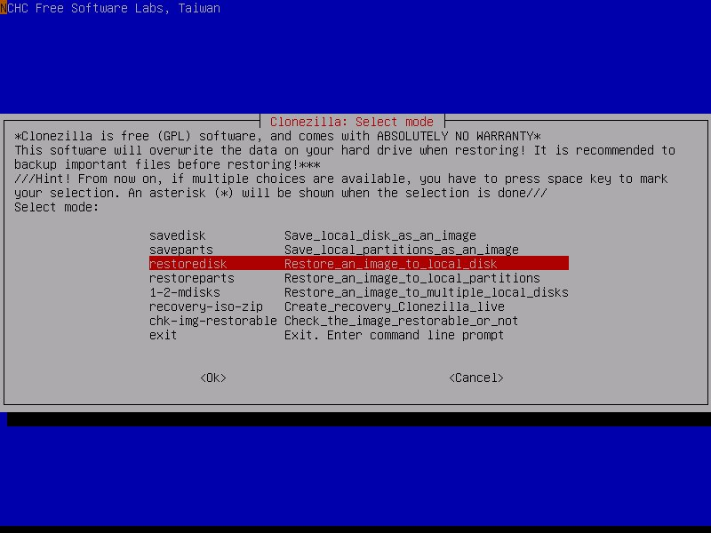

If you've ever been to Hamltion Library or Sinclair library, you probably would have noticed all the PCs that were available to use. What happens when one of these computers breaks? What happens when one these computers need a certain software installed on it? Well, that is where I come in. I work as a Student Support Specialist in the Desktop and Network Support department in Hamilton library. Basically, my job is an IT helpdesk assistant that helps library staff and patrons with problems regarding their computers or other electronic devices. 

Summer 2019 was probably that most busiest it has ever been working beause my fellow coworkers and I were tasked to upgrade every single computer to Windows 10. That may sound simple enough, but we also were tasked into upgrading each computer with a solid state drive. This means we had to backup everything from the hold computer hard drive, install windows 10 onto the new solid state drive, then copy over the files and install programs from the old computer. This made it 10x more cumbersome to do, but to make our jobs somewhat easier we used an imaging service called Clonezilla. This allowed us to save a base image of Windows 10 onto a server running Clonezilla, then we were able to connect to the server and download the Windows 10 image from the server onto the solid state drive. THere was also a lot of physical work to be done as we had to carry around computers from Hamilton library to Sinclair library. 

**Screenshot of the Clonezilla software used for imaging computers**

Although it was quite a daunting task, we managed to upgrade over 100 computers during the span of summer vacation. I learned quite a lot about the Windows operating system and computer hardware as I was working with these everyday. In the end, it felt quite rewarding knowing I was one of the persons working on the the computers in the library.

