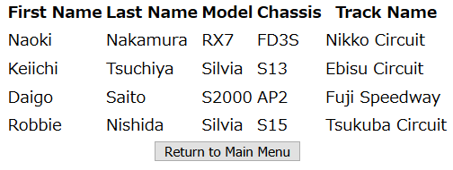

ドリフト天国 (Drift Tengoku) is Japanese for Drift Heaven. Inspired by my love for Japanese cars and drift racing, I created a website database used that stores differnet types of cars, drivers, and tracks that are in the drift scene in Japan. 

First of all, the website is hosted on 000webhost. I think it a great place to host your own website and it's free! I wanted to create a simple HTML webpage that vistors can easily access. The main index page features photos by Casey Dhnaram, a car photographer based in Japan. More of his work can be found <a href="https://shirtstuckedin.com/">here</a>. 

Aside from that, I inlcuded buttons to other HTML pages that allow you input data, update data, and delete data from the database.There is also a select menu that brings up PHP pages that allows you to view a list of all the cars in the database and a list of all drivers, their cars, and their track. A sample of the database can be found below.

The website can be viewed <a href="https://doritengoku.000webhostapp.com/index.html/">here</a>. 

