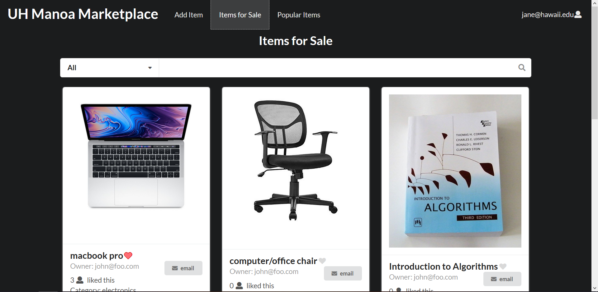
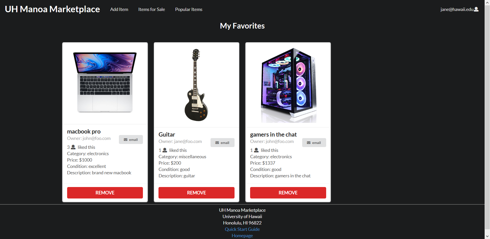
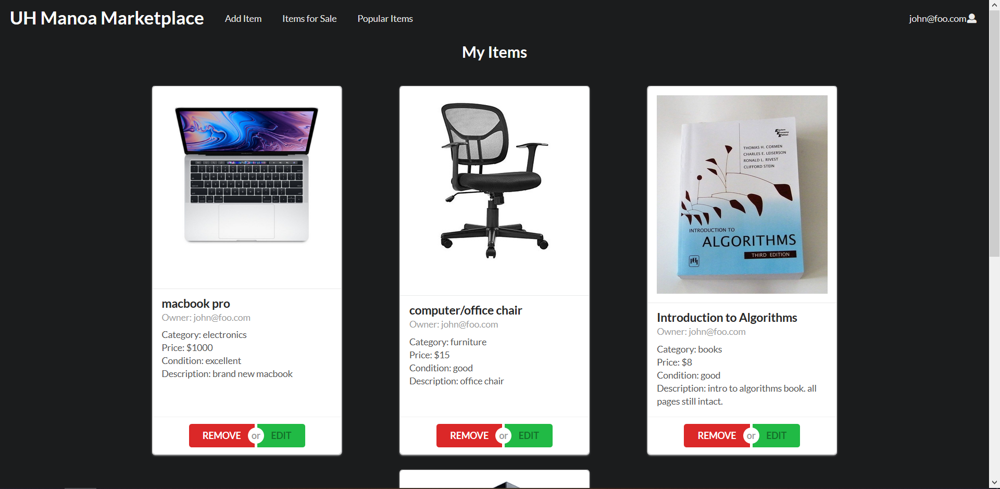
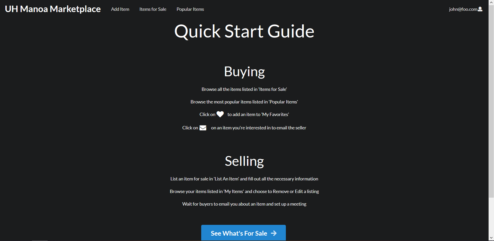

## Project Overview 
The UH Manoa Marketplace is a web application where people within the UH community are able to buy or sell their personal belongings. This application is great for students who travel off island at the end of the school year; instead of renting out a storage container, they can sell their appliances, used textbooks, or any unwanted items. We all know how expensive buying textbooks at the bookstore is, so this is one way to cut down on some of the cost. When buying textbooks, students can look them up using their ISBN, by the course, and/or by the Professor. This application is not just for the students at UH Manoa, but the faculty and staff can also register to buy and sell their belongings.

## Contribution
The contributions that I made to the project were creating the part of the item card.

The 'My Favorites' page which show all the items that the user has favorited.

The 'My Items Page' which allow you to view all the items that the user has listed for sale and choose if they want to remove or edit the item. The 'Edit Item' page allows the user to edit an item they have posted if they want to change the name, price, description, etc. 

The 'Quick Start Guide' page is shown right after a new user registers for an account. It shows the basic functions and navigations of the website when buying and selling.

I also did a lot of testing with the website, listing and removing items, and made sure everything on the site worked as it should.

## What I've Learned
As far as Software Engineering and Development, I'd say this is the most comprehensive programming that I have worked on. I learned a lot about front-end and back-end programming by working on the actual interface of the website and working on how everything works. I became more comfortable working with JavaScript, React, Meteor, and Semantic UI which were all topic that was covered throughout the course of the semester. Working with MongoDB gave me first hand experience with working on a database and how useful they are in storing data. Also, deploying our application through the meteor app showed me how website are acutally launched and how they can be visited by anyone on the internet. 

The Organization GitHub Page can be viewed <a href="https://uh-manoa-marketplace.github.io/">here</a>. 
